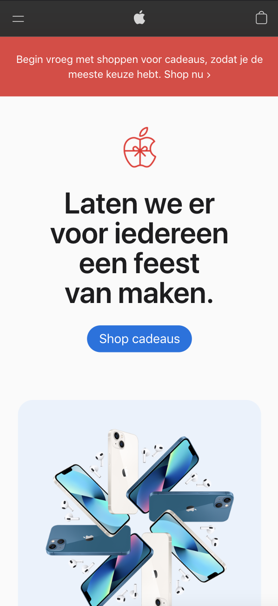
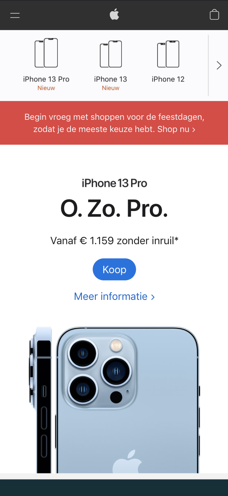
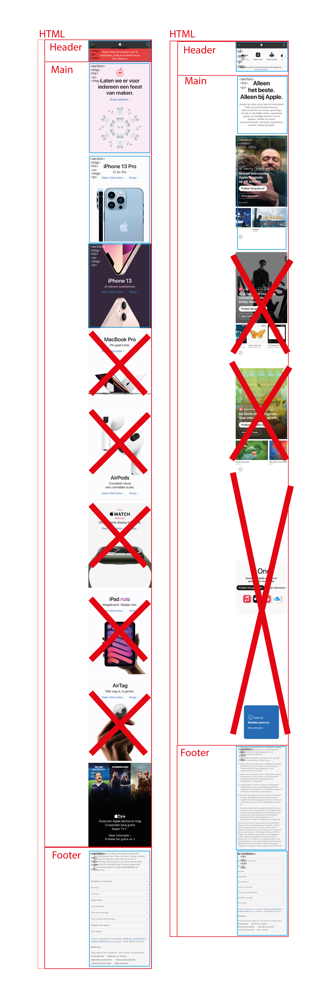
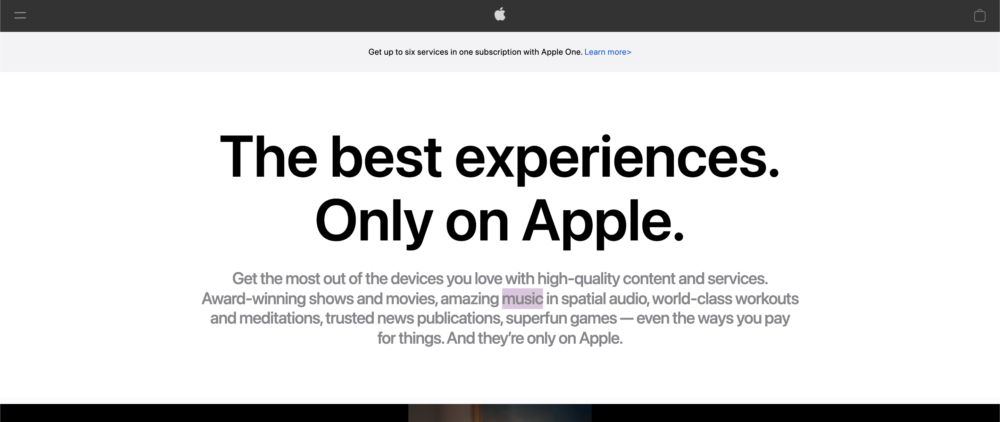
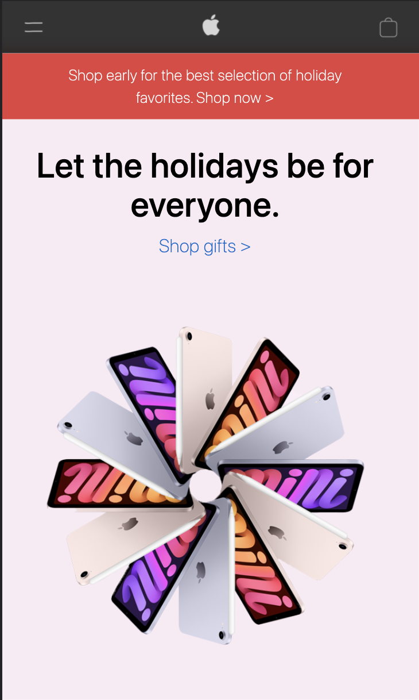
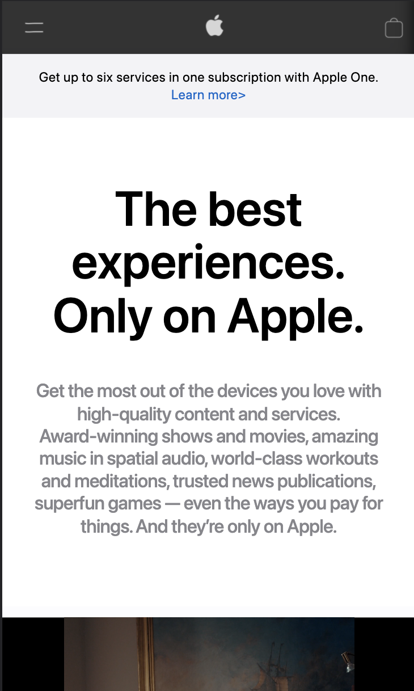

# Procesverslag
Markdown is een simpele manier om HTML te schrijven.  
Markdown cheat cheet: [Hulp bij het schrijven van Markdown](https://github.com/adam-p/markdown-here/wiki/Markdown-Cheatsheet).

Nb. De standaardstructuur en de spartaanse opmaak van de README.md zijn helemaal prima. Het gaat om de inhoud van je procesverslag. Besteedt de tijd voor pracht en praal aan je website.

Nb. Door *open* toe te voegen aan een *details* element kun je deze standaard open zetten. Fijn om dat steeds voor de relevante stuk(ken) te doen.

## Jij

uitwerken voor kick-off werkgroep

### Auteur:
Yousri Bouzaien (500731321)

#### Je startniveau:
Rood

#### Je focus:
Responsive (kies uit responsive óf surface plane)

## Je website

uitwerken voor kick-off werkgroep

### Je opdracht:
https://www.apple.com/

#### Screenshot(s) van de eerste pagina (small screen):
Home

#### Screenshot(s) van de tweede pagina (small screen):
iPhone

## Breakdownschets (week 1)

uitwerken na afloop 2e werkgroep

### de hele pagina:

## Voortgang 1 (week 2)

uitwerken voor 1e voortgang

### Stand van zaken
hier dit ging goed & dit was lastig (neem ook screenshots op van delen van je website en code)

### Agenda voor meeting
samen met je groepje opstellen

Wij hadden allen geen vragen

### Verslag van meeting
hier na afloop snel de uitkomsten van de meeting vastleggen

- Besproken hoe we het verder aan zulllen pakken en laten zien hoe ver we al zijn.

## Voortgang 2 (week 3)

uitwerken voor 2e voortgang

### Stand van zaken

Eigenlijk ging alles wel goed alleen met het hamburger menu waren een paar moeilijkheden maar die waren snel op te lossen!

### Agenda voor meeting
samen met je groepje opstellen

Ook hier hadden wij allemaal geen vragen.

### Verslag van meeting
hier na afloop snel de uitkomsten van de meeting vastleggen

- Code doorgekeken en in de CSS moet ik wat comments gaan toevoegen en kijken of ik met EM of PX ga werken. verder was
alles in orde.

## Toegankelijkheidstest (week 4)

uitwerken na test in 8e voortgang

### Bevindingen
Lijst met je bevindingen die in de test naar voren kwamen:

#### Titel eerste bevinding
Hamburger menu klapt niet open met gebruik van TAB.

Dit kan worden opgelost door van het hamburger menu icoontje ook een link te maken.

#### Titel tweede bevinding.
Hier korte omschrijving (met indien nodig een afbeelding)

Hier een omschrijving van hoe het opgelost kan worden (met indien nodig een afbeelding)

#### Titel volgende bevinding.
Hier korte omschrijving (met indien nodig een afbeelding)

Hier een omschrijving van hoe het opgelost kan worden (met indien nodig een afbeelding)

#### Titel nog een bevinding.
Hier korte omschrijving (met indien nodig een afbeelding)

Hier een omschrijving van hoe het opgelost kan worden (met indien nodig een afbeelding)

## Voortgang 3 (week 4)

uitwerken voor 3e voortgang

De enigste vraag die ik had was of je een andere video mocht gebruiken.
mijn medestudenten hadden geen vragen.

### Stand van zaken
De site is zo goed als af alleen nog de puntjes op de I en nog even kijken naar de responsiveness.

## Eindgesprek (week 5)

uitwerken voor eindgesprek

### Stand van zaken
Over het algemeen ging alles goed, ik kom er alleen niet uit hoe ik het hamburger menu weg krijg als ik op een desktop scherm kom.

### Screenshot(s)

hier screenshot(s) van je eindresultaat

## Bronnenlijst

continu bijhouden terwijl je werkt

Alle afbeeldingen zijn screenshots van de apple website.

1. https://css-tricks.com/snippets/css/a-guide-to-flexbox/
2. https://www.w3schools.com/tags/att_video_autoplay.asp
3. https://developer.mozilla.org/en-US/docs/Web/CSS/position
4. https://flaviocopes.com/rotate-image/

